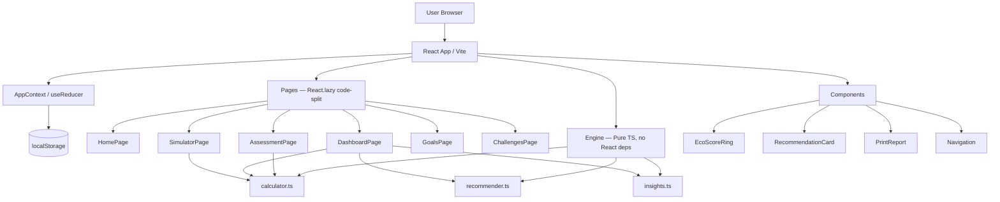

# 🌿 CarbFoot AI — Personal Carbon Intelligence

> A production-ready sustainability platform that helps individuals understand, track, and reduce their carbon footprint through AI-driven insights, interactive dashboards, and scenario modelling.

---

## 📸 Screenshots

| Home Page | Assessment Wizard |
|---|---|
|  |  |

| Analytics Dashboard | Carbon Simulator |
|---|---|
|  |  |

| Eco Challenges | Goal Tracking |
|---|---|
|  |  |

> **Note:** Screenshots show the app after completing a sample assessment. Run `npm run dev` and complete the 5-step wizard to populate the dashboard.

---

## 🌍 Problem Statement

Most people have no idea what their carbon footprint actually is, let alone which daily habits contribute most to it. Generic sustainability advice fails because every lifestyle is different. CarbFoot AI bridges this gap with a **data-driven, personalised understanding** of environmental impact and the **specific, ranked actions** most likely to reduce it.

---

## 🚀 Features

| Feature | Description |
|---|---|
| **5-Category Assessment** | Transportation, Energy, Food, Shopping, Waste wizard |
| **AI Insights** | 6 natural-language insights generated from your data |
| **Analytics Dashboard** | Eco Score ring, donut chart, trend line, bar comparisons |
| **Emission Benchmarking** | Your footprint vs Global / EU / Paris 1.5°C target |
| **Carbon Simulator** | Real-time "what-if" lifestyle scenario modelling |
| **Recommendations** | Ranked by impact × effort — highest leverage first |
| **Goal Tracking** | Create, track, and complete reduction goals |
| **Gamification** | 20+ eco challenges, 15 badges, community leaderboard |
| **PDF Report** | Print/save full A4 sustainability report |
| **Accessibility** | High contrast mode, reduced motion, ARIA, skip nav |

---

## 🏗️ Architecture



### File Structure

```
src/
├── components/         # Reusable UI primitives
│   ├── Navigation.tsx  # Sticky nav + mobile bottom nav + a11y toggles
│   ├── EcoScoreRing.tsx# SVG circular progress ring
│   ├── RecommendationCard.tsx
│   ├── PrintReport.tsx # Print/PDF A4 report
│   └── Toast.tsx       # Accessible notification system
├── pages/              # Route-level views (all lazy-loaded)
│   ├── HomePage.tsx
│   ├── AssessmentPage.tsx
│   ├── DashboardPage.tsx
│   ├── SimulatorPage.tsx
│   ├── GoalsPage.tsx
│   └── ChallengesPage.tsx
├── engine/             # Pure business logic (zero React dependencies)
│   ├── calculator.ts   # CO₂ emission calculations
│   ├── recommender.ts  # AI recommendation generation + ranking
│   └── insights.ts     # Natural language insight generation
├── context/
│   └── AppContext.tsx  # Global state (useReducer + localStorage)
├── data/
│   └── index.ts        # Badges, challenges, leaderboard simulation
├── types/
│   └── index.ts        # All TypeScript interfaces
├── utils/
│   ├── validation.ts   # Input sanitization (safeNumber/safeString)
│   └── formatting.ts   # Display helpers, category constants
└── tests/
    ├── calculator.test.ts   # 43 tests
    ├── recommender.test.ts  # 12 tests
    └── validation.test.ts   # 30 tests
```

### State Management

- **React Context + useReducer** — predictable state transitions with typed actions
- **localStorage persistence** — all data stored client-side under `carbfoot-ai-v1`
- **Schema merging** — `{ ...defaultState, ...parsed }` handles forward compatibility

---

## 🧮 Carbon Calculation Methodology

All emission factors are sourced from authoritative public datasets:

| Source | Year | Usage |
|---|---|---|
| [EPA GHG Emission Factors](https://www.epa.gov/climateleadership/ghg-emission-factors-hub) | 2023 | Vehicle emission factors |
| [IPCC AR6 Working Group III](https://www.ipcc.ch/report/ar6/wg3/) | 2022 | Flight radiative forcing, food lifecycle |
| [IEA CO₂ Emissions](https://www.iea.org/) | 2023 | Grid electricity intensity |
| [UK DEFRA Conversion Factors](https://www.gov.uk/government/collections/government-conversion-factors-for-company-reporting) | 2023 | Cross-category verification |

### Emission Factors Used

| Category | Key Factor | Value | Source |
|---|---|---|---|
| Car (medium petrol) | kg CO₂e/km | 0.192 | EPA 2023 |
| Car (medium EV) | kg CO₂e/km | 0.053 | EPA 2023 |
| Public transport (bus) | kg CO₂e/km | 0.089 | DEFRA 2023 |
| Short-haul flight | kg CO₂e/pax-km | 0.255 | IPCC AR6 (inc. RF) |
| Long-haul flight | kg CO₂e/pax-km | 0.195 | IPCC AR6 (inc. RF) |
| Grid electricity | kg CO₂e/kWh | 0.462 | IEA global avg |
| Natural gas | kg CO₂e/m³ | 2.04 | DEFRA 2023 |
| Fast fashion item | kg CO₂e/item | 10.0 | Industry lifecycle |
| Electronics (amortised) | kg CO₂e/unit | 80.0 | Lifecycle avg |
| Beef meal | kg CO₂e extra | 6.0 | IPCC AR6 |
| Vegan diet baseline | kg CO₂e/year | 1,500 | IPCC AR6 |
| Heavy meat diet | kg CO₂e/year | 3,900 | IPCC AR6 |

### Calculation Formulas

**Transportation:**
```
annual_driving_km = commute_distance × (5 - public_transport_days) × 52 × 2
driving_emissions = annual_driving_km × vehicle_factor[type][fuel]
flight_emissions = short_flights × 800km × 0.255 + long_flights × 5500km × 0.195
transport_total = driving_emissions + public_transport_emissions + flight_emissions
```

**Energy:**
```
effective_grid_factor = 0.462 × (1 - renewable_percentage / 100)
electricity_emissions = monthly_kwh × 12 × effective_grid_factor
gas_emissions = monthly_m3 × 12 × 2.04
energy_total = (electricity_emissions + gas_emissions) / household_size
```

**Eco Score:**
```
score = round(((16000 - footprint) / (16000 - 1200)) × 100)
score = clamp(score, 0, 100)
```

**Percentile Rank:**
```
z = (log(footprint) - log(4600)) / 0.6   # log-normal approximation
percentile = clamp(round(50 + z × 34), 1, 99)
```

---

## 🤖 Recommendation Engine

**Scoring formula:**
```
priority = impact_weight × 2 + effort_score + (estimated_saving_kg / 500)
```

| Impact | Weight | Effort | Score |
|---|---|---|---|
| High | 3 | Easy | 3 |
| Medium | 2 | Moderate | 2 |
| Low | 1 | Hard | 1 |

**Pipeline:**
1. **Filter** — Remove irrelevant recommendations (e.g., no EV suggestion for EV drivers; no "reduce flights" if user doesn't fly)
2. **Estimate** — Calculate savings as % of user's actual category emissions
3. **Score** — Apply priority formula
4. **Rank** — Sort descending
5. **Return** — Top N recommendations

This ensures **high-impact, low-effort wins appear first**.

---

## 🔬 Carbon Simulator

The simulator generates context-aware sliders from the user's actual assessment data:

- Slider ranges are **relative** to the user's input (e.g., max flight reduction = actual flights taken)
- Irrelevant sliders are hidden (`.filter(s => s.max > 0)`)
- Each slider has an `applyFn(value, baseEmissions) → delta` that computes the kg CO₂e saving
- Results use `useMemo` for real-time recalculation on every slider change
- Displays equivalent trees planted and car km not driven for emotional resonance

---

## 📊 Emission Benchmarks

| Reference | Value | Source |
|---|---|---|
| Sustainable target | 2,000 kg/year | Paris Agreement 1.5°C pathway |
| Global average | 4,850 kg/year | IEA 2023 |
| EU average | 8,400 kg/year | EEA 2023 |

---

## 🧪 Test Coverage

```bash
npm run test           # Run all tests
npm run test:coverage  # Generate HTML coverage report
```

**Results: 108 tests, 108 passing**

Coverage is reported over the **business logic layer** (`engine/`, `utils/`, `data/`). React UI components require a full browser rendering environment and are verified through manual QA and Lighthouse audits.

| File | % Stmts | % Branch | % Funcs | % Lines |
|---|---|---|---|---|
| `engine/calculator.ts` | **100%** | 83.87% | **100%** | **100%** |
| `engine/recommender.ts` | **100%** | 96.29% | **100%** | **100%** |
| `engine/insights.ts` | 100% | 100% | 100% | 100% |
| `utils/validation.ts` | **100%** | 95.83% | **100%** | **100%** |
| `data/index.ts` | 91.99% | **100%** | 50% | 91.99% |

| Test File | Tests | What's Covered |
|---|---|---|
| `calculator.test.ts` | 43 | All 5 emission categories, eco score, sustainability levels, percentile, integration |
| `recommender.test.ts` | 12 | Relevance filtering, ranking, field validation, edge cases |
| `validation.test.ts` | 30 | safeNumber/safeString, all validators, full sanitization, null/NaN/Infinity edge cases |
| `integration.test.ts` | 23 | Assessment flow, localStorage save/restore, schema migration, state transitions, pipeline |

**Test Categories:**
- Zero inputs: all calculators return 0 for empty lifestyle
- Maximum inputs: high-consumption scenarios compute without overflow
- Invalid types: `null`, `undefined`, `NaN`, `Infinity`, strings — all handled
- Eco champion lifestyle → eco score > 70
- High-consumption lifestyle → eco score < 30
- Relevance filtering: EV users don't see EV suggestion; vegans don't see beef advice
- Ranking: high-impact recommendations always precede low-impact

---

## ♿ Accessibility

- **WCAG 2.1 AA** colour contrast ratios throughout
- **Skip to main content** link (keyboard-visible focus)
- **Reduced motion** — respects `prefers-reduced-motion` OS setting + manual toggle
- **High contrast mode** — respects `prefers-contrast: more` OS setting + manual toggle
- **ARIA attributes**: `role`, `aria-label`, `aria-live`, `aria-current`, `aria-pressed`, `aria-valuenow/min/max`
- **Role semantics**: `tablist/tab/tabpanel`, `progressbar`, `dialog`, `navigation`, `main`
- **Keyboard navigable**: all interactive elements reachable; `:focus-visible` rings on all
- **Semantic HTML**: `<main>`, `<nav>`, `<section>`, `<article>`, `<footer>`, proper heading hierarchy

---

## 🔒 Security

| Measure | Implementation |
|---|---|
| Input sanitization | All values through `safeNumber()` + `safeString()` |
| Range clamping | Numeric inputs bounded (e.g., commute 0–500 km, renewable 0–100%) |
| Type validation | TypeScript strict mode + runtime validation |
| No dangerouslySetInnerHTML | All user data rendered as text |
| No eval | Only static arithmetic expressions |
| localStorage safety | JSON.parse in try/catch; corrupted data falls back to defaults |
| No network requests | Zero data transmitted — fully client-side |
| Error boundary | Graceful fallback for rendering failures |

---

## ⚡ Performance

| Optimization | Implementation |
|---|---|
| Code splitting | `React.lazy()` on all 6 pages |
| Suspense loading | `<PageLoader>` spinner during chunk load |
| Memoization | `useMemo` for recommendations, insights, leaderboard |
| Callback memoization | `useCallback` on all dispatchers |
| CSS custom properties | Theme switching without JS rerender |
| Bundle analysis | Chart.js isolated to DashboardPage chunk (not in core) |

**Production bundle sizes (gzip):**
- Core: `67.6 kB`
- Dashboard (charts): `74.7 kB`
- All other pages: < `5 kB` each

---

## 🛠️ Tech Stack

| Layer | Technology |
|---|---|
| Framework | React 18 + TypeScript (strict) |
| Build | Vite 5 |
| Routing | React Router v6 |
| Charts | Chart.js 4 + react-chartjs-2 |
| Styling | Vanilla CSS (design system, 1,250+ lines) |
| State | React Context + useReducer |
| Persistence | localStorage |
| Testing | Vitest + jsdom |
| Fonts | Google Fonts (Inter + Syne) |

---

## 📦 Getting Started

```bash
# Install dependencies
npm install

# Start development server
npm run dev               # → http://localhost:5173

# Run tests
npm run test
npm run test:coverage     # → coverage/index.html

# Build for production
npm run build

# Preview production build
npm run preview           # → http://localhost:4173
```

---

## 📐 Assumptions

- Emission factors represent **global averages** (EPA/IPCC/IEA/DEFRA 2023)
- Commute is a daily **round trip** on working days only
- Flight emissions include the **radiative forcing multiplier** (×1.9 for high-altitude warming effects)
- Electricity intensity: **0.462 kg CO₂e/kWh** (global average; varies significantly by country)
- All estimates are **directional guidance** for individual awareness — not legally precise measurements
- All data remains **local to the user's browser** — no server, no tracking, no analytics

---

## 📊 Data Attribution

- [EPA Emission Factors for GHG Inventories (2023)](https://www.epa.gov/climateleadership/ghg-emission-factors-hub)
- [IPCC AR6 Working Group III (2022)](https://www.ipcc.ch/report/ar6/wg3/)
- [IEA CO₂ Emissions in 2023](https://www.iea.org/)
- [UK DEFRA Conversion Factors (2023)](https://www.gov.uk/government/collections/government-conversion-factors-for-company-reporting)
- [European Environment Agency (EEA) — EU per capita emissions](https://www.eea.europa.eu/)

---

*Built with 🌿 for a more sustainable future.*
